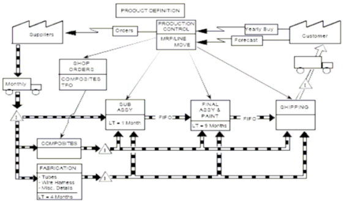
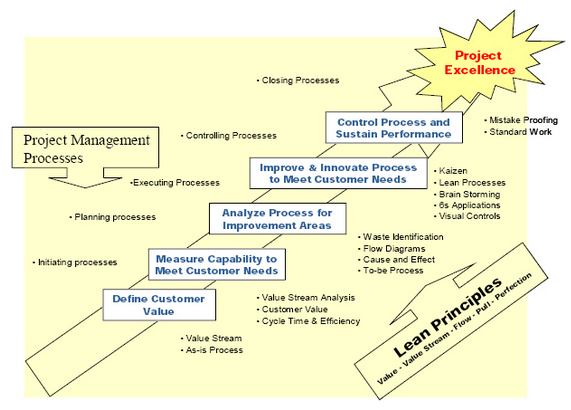

Source: Moujib, A. (2007). Lean Project Management. Paper presented at PMI® Global Congress 2007—EMEA, Budapest, Hungary. Newtown Square, PA: Project Management Institute.
Source URL: https://www.pmi.org/learning/library/lean-project-management-7364
Source references: Morgan, James, High Performance Product Development: A Systems Approach to a Lean Product Development Process, Doctoral thesis in Industrial and Operations Engineering, University of Michigan, 2002.
Shook, J., Rother, M., Learning to See. Value Stream Mapping to add value and Eliminate Muda, Brookline, MA: The Lean Enterprise Institute, 1999.
Womack, J., Jones, D., & Roos, D., (1990) The Machine that Changed the World: The Story of Lean Production, New York : HarperCollins,,.
Womack, J. & Jones, D.. (1996). Lean Thinking: Banish Waste and Create Wealth in Your Corporation. New York: Simon & Schuster,

# Lean Project Management
## Lean Principles
**Lean is a business philosophy**, not just a tool set/method for improvement.
This business philosophy derived from Toyota, in particular from its Toyota Production System (TPS).
The focus of the Lean philosophy is on reducing waste in all business processes, resulting in a reduction of cost and lead-time as well as an increase in quality
A breakthrough step from a push system (mass production) to a pull system (lean production), birthed from the 1973 energy crisis which Toyota was able to endure by working efficiently and effectively.
**Suggested further reading** Lean Thinking: Banish Waste and Create Wealth in Your Corporation -Womack and Jones(1996)
This book introduced five core principles:
1. Specify value in the eyes of the customer
 - Value is defined as "a capability provided to a customer at the right time at an appropriate price, as defined in each case by the customer."(Womack & Jones, 1996, p.353)
 - **Value is stated in the customer's word**
2. Identify the value stream for each product
 - A value stream includes "all the actions, both value added and non-value added, currently required to bring a product from raw material to the arms of the customer or through the design flow from concept to launch."(Morgan, 2002)
 - First create a value stream map that reflects the current state of the process being treated
 - Analyze the map for waste and value creation
 - Create a future-state map, representing how the process could and should operate
 - Generate an improvement plan to enable to transformation from current to future state
**Suggested further reading** Learning to See -Rother and Shook(1999)
This book contains a powerful technique to map value stream which facilitates the identification of wastes and allows process improvement

3. Make value flow by eliminating waste
 - Once the value is defined and the value stream is identified, create a continuous flow by eliminating backflows, scrap, rework, and interruptions
 - No stoppages, no waste
 - Work will fall into one of three types:
    1. Value-Added Work: essential changes to product/service, maximize this category as it provides customer value (Form, Fit, Function)
    2. Value-Enabling Work: potential for elimination in the future but can't be eliminated immediately, minimize this category and evolve
    3. Non Value-Added Work: can usually be eliminated quickly and is not dependent on improvement of other areas. This is pure waste and should be eliminated.
 - All of the waste ("pure" or "necessary") can be classified as one of the following 7 types:
    1. Over Production: producing more than is needed before it is needed
    2. Waiting: non-work time waiting for approval, supplies, parts, etc.
    3. Transportation: wasted effort to transport materials, parts, or finished goods between storages/processes
    4. Over Processing: doing more than is necessary (dictated by customer requirements)
    5. Inventory: maintaining excess inventory of raw materials, parts in process, or finished goods
    6. Motion: wasted motion to move parts, also wasted walking (moving hand to mouse)
    7. Defects: repair or rework
4. Let the customer pull the flow
 - The challenge being to avoid delivering value that has not been requested yet
 - Do not provide more than the initially agreed scope
 - In manufacturing this is typically accomplished by means of a Kanban system, allowing for just-in-time implementation
5. Continuously improve in the pursuit of perfection
 - This implies that the process improvement is endless
 - Constantly question the value of all activities
 - Perfection may never be achieved, but it should be constantly strived for

## Common Causes of Project Failure
### Real Life
- Focus on the product
- Focus on the team
- Keep the customer happy
- Dealing with a matrix organization, with people they have no power on
- Commonly overlooked, leading to project failure:
    1. Establish **real** customer value
    2. Set up a scope baseline control to avoid **scope creep**
    3. Build a communication plan to streamline the information flow
    4. Assess needs and get commitment from intended of deliverables
    5. Define project **value stream**
## Conclusion
The following roadmap is highly advocated:
 1. Establish your Project Value Stream
 2. Value from Customer's perspective
 3. Elimiate every waste possible
 4. Work to develop Customer loyalty

