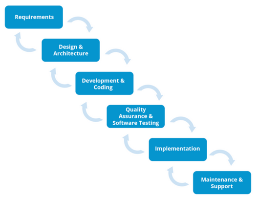
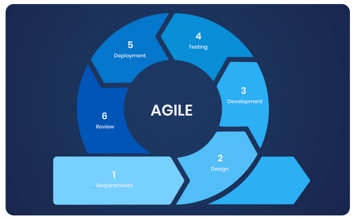
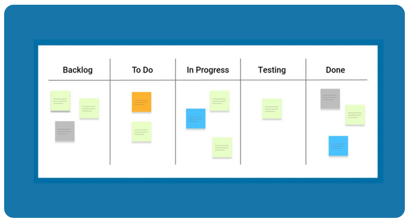
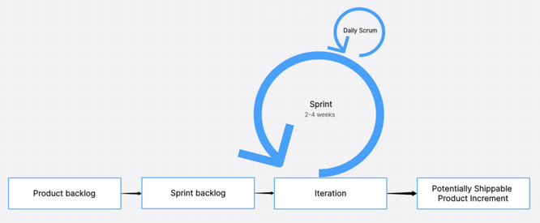

## What are the five stages of project management?
1. Initiating
    - Defining the project scope
    - Providing a high-level project overview
    - Establishing budgets
    For larger projects, a Project Initiation Documentation (PID) may be created to delve deeper into the above areas.
    During the planning phase, the following should be completed:
    - Select project team members
    - Outline deliverables
    - Estimate required project resources
    - Determine associated activities (dependencies)
    - Set key milestones and dates (evidence of progress/progression)
    The project management methodology can be outlined with options such as:
    1. Agile
    2. Waterfall
    3. Scrum
    4. Lean
    5. Kanban
2. Executing
    - This stage runs concurrently with Monitoring and Controlling phases and may involve managing workflows, recommending changes, and suggesting corrective actions
3. Monitoring
    - Regular checkins
    - Utilize the documentation and tracking tools outlined in the Initiating phase for visual and real-time monitoring
4. Controlling
    - This phase is taking feedback from the Monitoring phase and making positive change to the course via:
        - altering the goals of the project
        - enlisting help as it is found necessary
        - using new tools to provide further insights
5. Closing
    - Project delivery/closeout
    - Wrap up all activities and deliver the final poduct
    - This could also be an intermediary before handing off to another team to manage for their continuing portion

## What are the four type sof project management? (five listed above)
1. Waterfall
 - Focuses on metliculously planning, breaking down, and scheduling the entire project sequentially. Best suited for when all project requirements can be reasonably defined upfront as well as fixed deadlines
 -
2. Agile
 - An iterative approach enabling quick response to project feedback. Agile prioritizes:
    - adaptability
    - collaberation
    - incremental delivery
 - These qualities make it ideal for complex projects with evolving requirements, especially software development
 - 
3. Kanban
 - Focuses on continuous improvement through visualizing and managing the flow of work
 - Tasks move across the Kanban board as the project progresses, allowing for rapid adaptation and resolution of bottlenecks
 - Beneficial for projects with unpredictable workloads
 - 
4. Scrum
 - Divides larger projects into shorter sprints, adapting to project demands as it evolves
 - Rules are defined for:
    - team size
    - roles
    - planning
    - meetings
    - deliverables
 - 
5. [Lean (Not covered in article)](leanpmnotes.md)

## Eight tips for successfull project management
1. Invest in the initiation and planning stages to avoid later confusion
2. Choose the proper fraemwork or methodology 
3. Promote a culture of transparency and ownership to improve communication and collaboration
4. Define a realistic project scope to prevent **scope creep**
5. Prioritize efficient scheduling for better time management
6. Practice effective resource management to maximize efficiency
7. Engage and maintain strong communication with the intended recipient of the deliverables throughout the project
8. Leverage project management tools to streamline the workflow and facilitate decision-making

Suggested software: Salesforce for project management
Software URL: https://www.salesforce.com/
